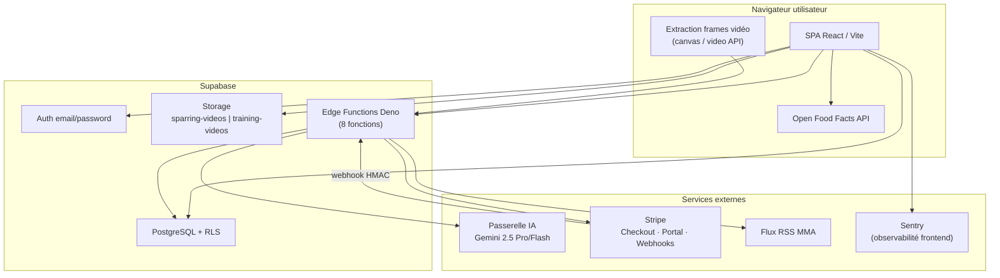
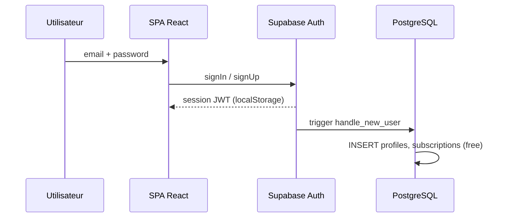
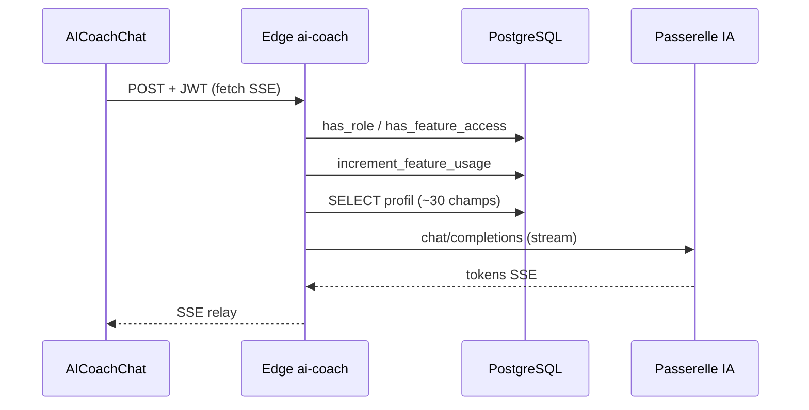
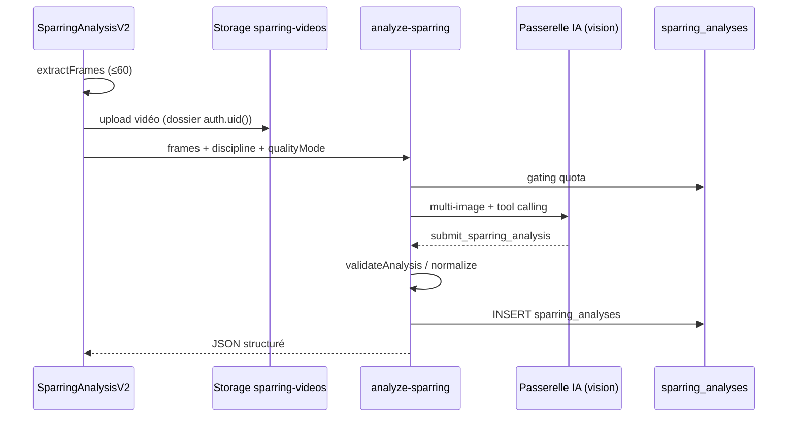
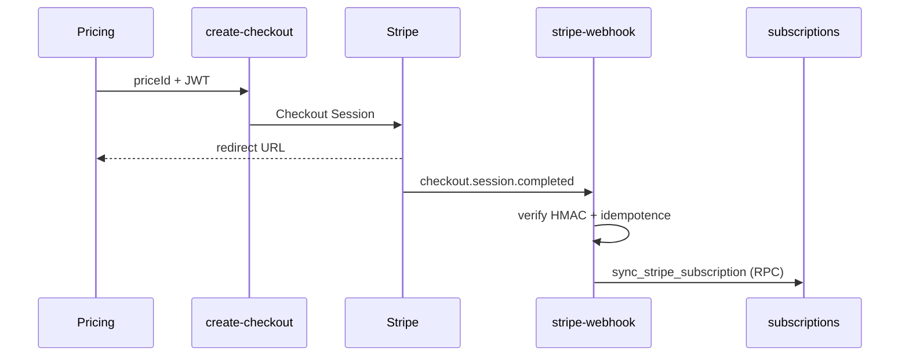

# Architecture — KOREV Performance Center

**Version :** 1.0  
**Alignement :** [`docs/audit/PROJECT_DOCUMENTATION_STANDARD.md`](../audit/PROJECT_DOCUMENTATION_STANDARD.md)

---

## 1. Contexte système

KOREV Performance Center est une **Single Page Application (SPA)** React couplée à **Supabase** (PostgreSQL, Auth, Storage, Edge Functions Deno). Les fonctionnalités IA (Coach, statistiques, vision sparring) passent par une **passerelle IA externe** appelée depuis les Edge Functions. Les paiements sont gérés par **Stripe**.



---

## 2. Stack technique

### 2.1 Frontend

| Composant | Technologie | Version observée |
|---|---|---|
| Framework UI | React | 18.3 |
| Bundler | Vite + `@vitejs/plugin-react-swc` | 5.4 |
| Langage | TypeScript | 5.5 (mode non strict) |
| Styles | Tailwind CSS + shadcn-ui (Radix) | 3.4 |
| Routage | React Router DOM | 6.26 |
| État serveur | TanStack React Query | 5.56 |
| Formulaires | React Hook Form + Zod | 7.53 / 3.23 |
| Graphiques | Recharts | 2.12 |
| PDF | jsPDF | 3.0 |
| Scan code-barres | ZXing | 0.1 / 0.21 |
| Animations | Framer Motion | 12.23 |
| Observabilité | `@sentry/react` | 10.54 |

**Point d'entrée :** `src/main.tsx` → `src/App.tsx` (providers, routes).

### 2.2 Backend (Supabase)

| Service | Usage |
|---|---|
| PostgreSQL | Données relationnelles, RLS, fonctions SQL `SECURITY DEFINER` |
| Auth | Email/mot de passe, session `localStorage` |
| Storage | Vidéos sparring (privé) et entraînement (lecture conditionnelle) |
| Edge Functions | Logique serveur (IA, Stripe, agrégation RSS) |

**Projet Supabase référencé :** `vpvfkazmfvxbpffymodg` (dans `supabase/config.toml`).

### 2.3 Tests et CI

| Outil | Périmètre |
|---|---|
| Vitest + Testing Library | Unitaires (`src/utils/**`, gamification, sparring schema) |
| Playwright | E2E (`e2e/sparring-analysis.spec.ts`) — opt-in CI |
| Harness Deno | Edge Functions critiques (`tests/edge/`) — exécution manuelle |
| GitHub Actions | Lint (non bloquant), tests, build sur `main` |

---

## 3. Architecture applicative frontend

### 3.1 Organisation par domaine

```text
src/
├── pages/              Pages routées (Auth, Index, admin/*, …)
├── components/         Composants métier
│   ├── sparring/       Analyse vidéo IA
│   ├── gamification/   UI Wolf Pack
│   ├── workout/        Séances v2
│   ├── admin/          Back-office
│   └── ui/             Primitives shadcn-ui
├── hooks/              État et accès Supabase
├── utils/              Logique pure (sparring, gamification, retry)
└── integrations/supabase/
    ├── client.ts       Client Supabase (source unique config)
    └── types.ts        Types générés PostgreSQL
```

### 3.2 Pattern de séparation

| Couche | Responsabilité |
|---|---|
| `utils/` | Logique pure, testable (XP, validation JSON sparring, extraction frames) |
| `hooks/` | État React, appels Supabase, cache React Query |
| `components/` | Rendu UI, orchestration utilisateur |
| `pages/` | Composition de pages, routage |

### 3.3 Routage et protection

Défini dans `src/App.tsx` :

- **`ProtectedRoute`** : authentification requise ; redirection onboarding si champs profil manquants ;
- **`PublicRoute`** : redirection vers `/` si déjà connecté ;
- **`AdminLayout`** : accès réservé aux rôles `admin` ou `coach`.

### 3.4 Providers

- `QueryClientProvider` (TanStack Query)
- `AuthProvider` (`useAuth`)
- `GamificationProvider` (partiel, via `useGamification`)

---

## 4. Flux de données principaux

### 4.1 Authentification



### 4.2 Coach IA (streaming)



> Le client utilise un `fetch` brut pour le SSE car `supabase.functions.invoke` ne supporte pas le streaming.

### 4.3 Analyse sparring



### 4.4 Abonnement Stripe



---

## 5. Sécurité

### 5.1 Row-Level Security (RLS)

RLS activée sur toutes les tables applicatives versionnées. Principes :

- Ressources personnelles : `auth.uid() = user_id` ;
- `subscriptions` : écriture utilisateur supprimée (mai 2026) — réservée service role / webhook ;
- `feature_usage` : écriture uniquement via `increment_feature_usage` (`SECURITY DEFINER`) ;
- Meutes : helpers `is_meute_member`, `is_meute_owner`, `get_meute_member_role` pour éviter récursion RLS ;
- `stripe_webhook_events` : RLS sans policy applicative (service role uniquement).

### 5.2 Rôles applicatifs

Enum `app_role` : `admin | user | coach`.

| Rôle | Effet |
|---|---|
| `admin` | Back-office, bypass quotas, gestion vidéos |
| `coach` | Back-office, bypass quotas, publication vidéos |
| `user` | Utilisateur standard, soumis aux plans |

Fonction SQL : `has_role(_user_id, _role)`.

### 5.3 Edge Functions — JWT

| Fonction | `verify_jwt` |
|---|---|
| `ai-coach`, `ai-stats-analysis`, `analyze-sparring` | `true` |
| `create-checkout`, `check-subscription`, `customer-portal` | `true` |
| `fetch-mma-results` | `false` (public) |
| `stripe-webhook` | `false` (auth HMAC Stripe) |

Configuration : `supabase/config.toml`.

### 5.4 Secrets

| Portée | Variables | Stockage |
|---|---|---|
| Client (publiables) | `VITE_SUPABASE_URL`, `VITE_SUPABASE_PUBLISHABLE_KEY`, `VITE_SENTRY_DSN` | `.env` local, secrets CI |
| Edge (sensibles) | `SUPABASE_SERVICE_ROLE_KEY`, `STRIPE_*`, `AI_GATEWAY_*` | Secrets Supabase Dashboard |

Source unique client : `src/integrations/supabase/client.ts`.

### 5.5 Storage

| Bucket | Accès |
|---|---|
| `sparring-videos` | Privé, segmenté par `auth.uid()` ; URLs signées (1 h) via `storageUtils.ts` |
| `training-videos` | Lecture selon `visibility` + plan + rôle ; écriture admin/coach |

---

## 6. Intégrations externes

| Service | Usage | Criticité |
|---|---|---|
| Passerelle IA | Coach, stats, vision sparring | Critique |
| Stripe | Paiements, abonnements | Critique |
| Open Food Facts | Recherche nutrition (client) | Moyenne |
| RSS (Sherdog, MMA Fighting, Bloody Elbow) | Actualités MMA | Faible |
| Sentry | Erreurs frontend | Faible (optionnel) |

Modèles IA codés en dur :

- **Gemini 2.5 Flash** : coach IA, analyse statistique ;
- **Gemini 2.5 Pro** : analyse sparring (défaut) ;
- **Gemini 2.5 Flash** : analyse sparring mode `qualityMode='fast'`.

Configuration centralisée : `supabase/functions/_shared/ai-gateway.ts`.

---

## 7. Feature gating (monétisation)

Trois points d'application convergents :

1. **PostgreSQL** : `has_feature_access`, `get_feature_usage`, `increment_feature_usage` (source de vérité) ;
2. **React** : `useFeatureAccess` + `useFeatureGate` (cache UI, paywall) ;
3. **Edge IA** : vérification serveur dans `ai-coach` et `analyze-sparring`.

Bypass total pour rôles `admin` et `coach`.

Configuration UI : `FEATURE_CONFIG` dans `src/hooks/useFeatureAccess.tsx`.

---

## 8. Modules différenciants

| Module | Fichiers clés | Description |
|---|---|---|
| Pipeline sparring | `videoFrameExtractor.ts`, `sparringAnalysisSchema.ts`, `analyze-sparring/` | Extraction client → vision LLM tool calling → validation |
| Wolf Pack | `utils/gamification/wolfPack.ts`, `useGamification.tsx` | 7 rangs, 9 badges, XP, streaks |
| Gating multi-plans | `useFeatureAccess.tsx`, migrations feature_usage | Quotas atomiques PostgreSQL |

---

## 9. Limites architecturales connues

| Point | Détail |
|---|---|
| Hébergement frontend | Non versionné dans le dépôt (TBD) |
| XP gamification | Persistance `localStorage` (non synchronisée multi-appareils) |
| RAG vectoriel | Table `documents` typée mais non utilisée — voir [`SCHEMA_DRIFT.md`](../audit/SCHEMA_DRIFT.md) |
| Multi-organisations B2B | Scaffold dormant (`organizations*`) — non exposé |
| Mapping Stripe | `product_id → plan` dupliqué entre `check-subscription` et `stripe-webhook` |
| TypeScript | Mode non strict — roadmap dans [`TYPESCRIPT_STRICTNESS_ROADMAP.md`](../audit/TYPESCRIPT_STRICTNESS_ROADMAP.md) |

---

## 10. Références

- Schéma base : [`DATABASE.md`](DATABASE.md)
- Edge Functions : [`EDGE_FUNCTIONS.md`](EDGE_FUNCTIONS.md)
- Développement : [`../development/DEVELOPMENT.md`](../development/DEVELOPMENT.md)
- Déploiement : [`../development/DEPLOYMENT.md`](../development/DEPLOYMENT.md)

---

© KOREV AI — Architecture v1.0
