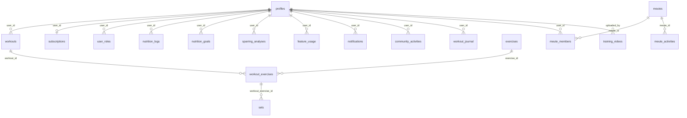

# Base de données — KOREV Performance Center

**Version :** 1.0  
**Migrations :** `supabase/migrations/` (28 fichiers SQL)  
**Types générés :** `src/integrations/supabase/types.ts`  
**Drift résiduel :** [`docs/audit/SCHEMA_DRIFT.md`](../audit/SCHEMA_DRIFT.md)

---

## 1. Vue d'ensemble

La base PostgreSQL Supabase héberge **19 tables applicatives** créées par les migrations versionnées, plus **5 tables typées** dans `types.ts` sans migration ni usage applicatif (scaffold dormant ou résidus RAG).

Toutes les tables applicatives ont **Row-Level Security (RLS)** activée.



---

## 2. Tables principales (versionnées)

### 2.1 Utilisateurs et profil

#### `profiles`

Profil sportif étendu (22 colonnes ajoutées en mai 2026).

| Colonne | Type | Description |
|---|---|---|
| `id` | UUID PK | Référence `auth.users` |
| `email`, `full_name`, `avatar_url` | TEXT | Identité |
| `weight`, `height` | DECIMAL / INT | Anthropométrie |
| `fitness_level` | TEXT | beginner / intermediate / advanced / expert |
| `martial_arts_discipline` | TEXT | Discipline principale |
| `goals` | TEXT[] | Objectifs sportifs |
| `body_fat_percent`, `waist_cm`, `morphotype`, `handedness` | divers | Profil physique avancé |
| `injuries` | TEXT[] | Blessures déclarées |
| `years_practice`, `belt_rank`, `secondary_disciplines[]` | divers | Expérience martiale |
| `competition_level`, `competitions_count` | divers | Parcours compétition |
| `primary_goal`, `goal_deadline`, `target_event` | divers | Objectifs SMART |
| `sleep_hours`, `stress_level`, `weekly_availability` | divers | Lifestyle |
| `preferred_session_duration`, `training_location`, `equipment[]` | divers | Contexte entraînement |
| `dietary_restrictions[]` | TEXT[] | Restrictions alimentaires |

**Triggers :** `handle_new_user` à l'inscription ; `update_updated_at_column`.

#### `user_roles`

| Colonne | Description |
|---|---|
| `user_id` | UUID utilisateur |
| `role` | Enum `app_role` : admin, user, coach |

#### `subscriptions`

| Colonne | Description |
|---|---|
| `user_id` | Propriétaire |
| `plan` | Enum : free, pro, elite, sensei |
| `status` | active, canceled, etc. |
| `stripe_customer_id`, `stripe_subscription_id` | Liaison Stripe |
| `current_period_end`, `cancel_at_period_end` | Cycle facturation |

> **RLS (mai 2026) :** INSERT/UPDATE utilisateur supprimés — synchronisation via webhook Stripe et service role uniquement.

#### `stripe_webhook_events`

Idempotence webhook Stripe (`stripe_event_id` unique).

---

### 2.2 Entraînement

#### `exercises`

Catalogue d'exercices (nom, catégorie, muscle group, etc.).

#### `workouts`

| Colonne | Description |
|---|---|
| `user_id` | Propriétaire |
| `status` | active / completed |
| `phase` | warmup / active / cooldown |
| `started_at`, `completed_at` | Horodatage |
| `total_volume`, `estimated_calories` | Agrégats |

#### `workout_exercises`

Liaison workout ↔ exercice (ordre, notes).

#### `sets`

Séries : poids, répétitions, durée, etc.

#### `workout_journal`

Notes libres d'entraînement par utilisateur et date.

---

### 2.3 Nutrition

#### `nutrition_logs`

Entrées alimentaires par repas et date. Index composite `(user_id, date)` ajouté en `20260526133146_*.sql`.

#### `nutrition_goals`

Objectifs caloriques et macros par utilisateur.

---

### 2.4 Sparring et vidéos

#### `sparring_analyses`

Résultats structurés d'analyse vidéo IA (JSON normalisé, métadonnées discipline, lien storage).

#### `training_videos`

| Colonne | Description |
|---|---|
| `title`, `description`, `video_url` | Contenu |
| `visibility` | public / premium |
| `coach_name` | Auteur |
| `views_count` | Compteur (RPC `increment_video_views`) |
| `uploaded_by` | Référence profil |

---

### 2.5 Communauté et meutes

#### `meutes`

Groupes : nom, description, `owner_id`, avatar.

#### `meute_members`

| Colonne | Description |
|---|---|
| `meute_id`, `user_id` | Appartenance |
| `role` | owner / admin / member |
| `status` | pending / active |

Trigger anti-escalade de privilège (migration `20260526125359_*.sql`).

#### `meute_activities`

Journal d'événements du groupe.

#### `community_activities`

Flux d'activité communautaire global. Trigger `on_workout_completed` à la fin de séance.

#### `notifications`

Notifications in-app (lu/non lu).

---

### 2.6 Feature gating

#### `feature_usage`

| Colonne | Description |
|---|---|
| `user_id`, `feature_name` | Clé composite logique |
| `usage_count` | Compteur mensuel |
| `period_start` | Début période |

> **RLS (mai 2026) :** INSERT/UPDATE utilisateur supprimés — écriture via `increment_feature_usage` uniquement.

---

## 3. Fonctions SQL principales

| Fonction | Rôle | Type |
|---|---|---|
| `handle_new_user` | Création profil à l'inscription | SECURITY DEFINER |
| `handle_new_user_subscription` | Abonnement Free par défaut | SECURITY DEFINER |
| `has_role(_user_id, _role)` | Vérification rôle | SECURITY DEFINER |
| `has_feature_access(_user_id, _feature)` | Accès fonctionnalité selon plan | SECURITY DEFINER |
| `get_feature_usage(_user_id, _feature_name)` | Lecture quota | SECURITY DEFINER |
| `increment_feature_usage(_user_id, _feature_name)` | Incrément atomique quota | SECURITY DEFINER |
| `get_feature_limit(_plan, _feature)` | Limite par plan | SECURITY DEFINER |
| `create_notification(...)` | Création notification | SECURITY DEFINER |
| `create_community_activity_on_workout` | Activité communautaire auto | Trigger |
| `handle_new_meute` | Initialisation meute | SECURITY DEFINER |
| `increment_video_views(_video_id)` | Compteur vues | SECURITY DEFINER |
| `is_meute_member` / `is_meute_owner` / `get_meute_member_role` | Helpers RLS meutes | SECURITY DEFINER |
| `is_webhook_processed` / `mark_webhook_processed` | Idempotence Stripe | SECURITY DEFINER |
| `sync_stripe_subscription(...)` | Sync abonnement depuis webhook | SECURITY DEFINER |
| `get_user_id_by_stripe_customer` | Résolution customer → user | SECURITY DEFINER |
| `check_subscription_access` | Vérification accès plan | SECURITY DEFINER |
| `update_updated_at_column` | Horodatage auto | SECURITY INVOKER |

---

## 4. Triggers notables

| Trigger | Table | Effet |
|---|---|---|
| `on_auth_user_created` | `auth.users` | INSERT `profiles` |
| `update_*_updated_at` | Tables principales | MAJ `updated_at` |
| `on_workout_completed` | `workouts` | INSERT `community_activities` |
| Anti-escalade privilège | `meute_members` | Empêche élévation de rôle non autorisée |

---

## 5. Storage (buckets)

| Bucket | Politique |
|---|---|
| `sparring-videos` | Privé ; chemin `{user_id}/…` ; URLs signées |
| `training-videos` | Lecture : visibilité + plan + rôle ; écriture : admin/coach |

---

## 6. Migrations

### 6.1 Emplacement

```text
supabase/migrations/
├── 20250925225543_*.sql    # profiles, auth trigger
├── 20251010080939_*.sql    # workouts, exercises
├── 20251205232737_*.sql    # user_roles, app_role
├── 20251206004851_*.sql    # feature_usage, has_feature_access
├── 20251205234548_*.sql    # meutes
├── 20260525214700_*.sql    # extension profil (22 colonnes)
├── 20260525215520_*.sql    # durcissement RLS subscriptions
├── 20260526095651_*.sql    # verrou feature_usage
├── 20260526100900_*.sql    # helpers RLS meutes
├── 20260526120000_*.sql    # stripe_webhook_events + RPCs
├── 20260526125359_*.sql    # trigger anti-escalade meute_members
└── 20260526133146_*.sql    # index nutrition_logs(user_id, date)
```

### 6.2 Application

```bash
# Via CLI Supabase (environnement configuré)
supabase db push

# Ou exécution manuelle ordonnée par timestamp
```

### 6.3 Seed administrateur

Script paramétré (non automatique) : `supabase/seed/seed-admin.example.sql`  
Remplacer `<ADMIN_USER_UUID>` par l'UUID effectif après création du compte.

---

## 7. Drift schéma (hors migrations versionnées)

Documenté intégralement dans [`SCHEMA_DRIFT.md`](../audit/SCHEMA_DRIFT.md).

| Objet | Statut | Action recommandée |
|---|---|---|
| `documents` + `match_documents` | Résidu RAG non utilisé | DROP manuel après confirmation |
| `organizations`, `organization_members`, `organization_invitations`, `render_usage` | Scaffold B2B dormant | DROP ou migration future |
| Enums `organization_role`, `subscription_tier` | Liés au scaffold | Purge avec tables |

**Ne pas référencer ces tables** dans le code applicatif tant qu'elles ne sont pas formalisées par migration.

---

## 8. RLS — synthèse par table

| Table | Lecture | Écriture utilisateur |
|---|---|---|
| `profiles` | Propre profil | Propre profil |
| `workouts`, `sets`, `nutrition_*` | `auth.uid() = user_id` | Idem |
| `subscriptions` | Propre ligne | **Interdit** (service role) |
| `feature_usage` | Propre ligne | **Interdit** (RPC uniquement) |
| `meutes` / `meute_members` | Membres via helpers | Selon rôle meute |
| `training_videos` | Visibilité + plan | admin/coach |
| `community_activities` | Authentifiés | Insert contrôlé |
| `stripe_webhook_events` | Service role | Service role |

---

## 9. Régénération des types TypeScript

Après modification du schéma en base :

```bash
supabase gen types typescript --project-id <project-ref> > src/integrations/supabase/types.ts
```

Vérifier ensuite [`SCHEMA_DRIFT.md`](../audit/SCHEMA_DRIFT.md) pour cohérence types ↔ migrations.

---

© KOREV AI — Base de données v1.0
