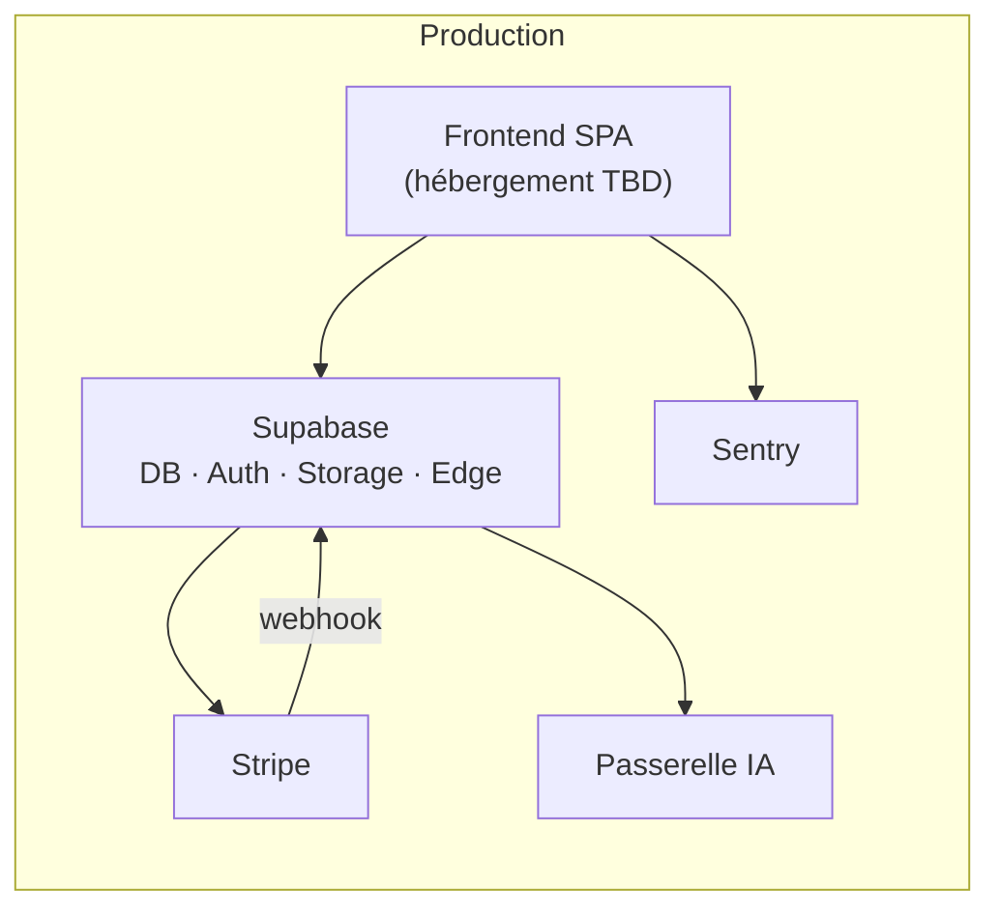

# Guide de déploiement — KOREV Performance Center

**Version :** 1.0  
**Checklist complémentaire :** [`docs/audit/LAUNCH_READINESS.md`](../audit/LAUNCH_READINESS.md)

---

## 1. Vue d'ensemble

Le déploiement couvre quatre composants :

| Composant | Plateforme | Statut dans le dépôt |
|---|---|---|
| Base de données + Auth + Storage | Supabase | Migrations versionnées |
| Edge Functions (8) | Supabase | Code versionné |
| Frontend SPA | **À confirmer** (TBD) | Build Vite → `dist/` |
| Paiements | Stripe | Webhook + Checkout |



---

## 2. Prérequis

- Compte **Supabase** (projet production)
- Compte **Stripe** (mode live activé pour production)
- Compte **Sentry** (optionnel, recommandé)
- Accès **passerelle IA** (URL + clé API)
- Plateforme d'**hébergement frontend** (Netlify, Vercel, Cloudflare Pages, S3+CloudFront, etc. — non décidé dans le dépôt)

---

## 3. Supabase — base de données

### 3.1 Appliquer les migrations

```bash
supabase link --project-ref <project-ref>
supabase db push
```

Vérifier l'application des 28 migrations dans l'ordre chronologique (`supabase/migrations/`).

### 3.2 Post-déploiement

1. **Régénérer les types** si le schéma distant diffère :

   ```bash
   supabase gen types typescript --project-id <ref> > src/integrations/supabase/types.ts
   ```

2. **Traiter le drift résiduel** documenté dans [`SCHEMA_DRIFT.md`](../audit/SCHEMA_DRIFT.md) (tables `documents`, `organizations*` — DROP manuel si confirmé).
3. **Provisionner un administrateur** :
   - Créer le compte admin via l'UI ;
   - Exécuter `supabase/seed/seed-admin.example.sql` avec l'UUID effectif.

### 3.3 Auth

- Vérifier les URLs de redirection autorisées (domaine frontend production) ;
- Configurer les templates email (confirmation, reset password) ;
- Politique mot de passe : minimum 6 caractères (aligné sur validation client).

### 3.4 Storage

Buckets requis :

| Bucket | Type | Politique |
|---|---|---|
| `sparring-videos` | Privé | RLS par dossier `auth.uid()` |
| `training-videos` | Public/privé mixte | Policies visibilité + plan |

Les policies sont définies dans les migrations ; vérifier leur présence post-`db push`.

---

## 4. Supabase — Edge Functions

### 4.1 Déploiement

```bash
supabase functions deploy
```

Ou fonction par fonction :

```bash
supabase functions deploy ai-coach
supabase functions deploy ai-stats-analysis
supabase functions deploy analyze-sparring
supabase functions deploy create-checkout
supabase functions deploy check-subscription
supabase functions deploy customer-portal
supabase functions deploy stripe-webhook
supabase functions deploy fetch-mma-results
```

La configuration JWT est dans `supabase/config.toml` :

- `stripe-webhook` et `fetch-mma-results` : `verify_jwt = false`

### 4.2 Secrets (Dashboard ou CLI)

```bash
supabase secrets set SUPABASE_SERVICE_ROLE_KEY=<service_role_key>
supabase secrets set STRIPE_SECRET_KEY=sk_live_...
supabase secrets set STRIPE_WEBHOOK_SECRET=whsec_...
supabase secrets set AI_GATEWAY_API_KEY=<key>
supabase secrets set AI_GATEWAY_URL=<url>   # si override nécessaire
```

| Secret | Obligatoire | Fonctions |
|---|---|---|
| `SUPABASE_SERVICE_ROLE_KEY` | Oui | Toutes sauf fetch-mma-results |
| `STRIPE_SECRET_KEY` | Oui | Stripe (4 fonctions) |
| `STRIPE_WEBHOOK_SECRET` | Oui | stripe-webhook |
| `AI_GATEWAY_API_KEY` | Oui | 3 fonctions IA |
| `AI_GATEWAY_URL` | Non | Override URL passerelle |

### 4.3 Vérification post-déploiement

```bash
# Test webhook (signature requise — utiliser Stripe CLI)
stripe listen --forward-to https://<ref>.supabase.co/functions/v1/stripe-webhook

# Logs
supabase functions logs stripe-webhook
```

Harness Deno local : `deno test --allow-env --allow-net=none tests/edge`

---

## 5. Stripe

### 5.1 Produits et prix

Quatre plans applicatifs mappés à des produits Stripe :

| Plan | Prix mensuel (UI) | Price ID (code) |
|---|---|---|
| Pro | 14,90 € | `price_1SQSL1DLrTr0qdOpfIx50iSu` |
| Elite | 29,90 € | `price_1SQSLMDLrTr0qdOpffTBpoJL` |
| Senseï | 69 € | `price_1SQSM0DLrTr0qdOpYtZFR50d` |

> Les price IDs sont **codés en dur** dans `src/pages/Pricing.tsx`. Pour un environnement distinct (staging), créer des produits/prix Stripe dédiés et mettre à jour le code ou externaliser la configuration.

### 5.2 Webhook

1. Dashboard Stripe → Developers → Webhooks ;
2. Endpoint : `https://<project-ref>.supabase.co/functions/v1/stripe-webhook` ;
3. Événements :
   - `checkout.session.completed`
   - `customer.subscription.created`
   - `customer.subscription.updated`
   - `customer.subscription.deleted`
4. Copier le **signing secret** (`whsec_…`) → secret Supabase `STRIPE_WEBHOOK_SECRET`.

### 5.3 Customer Portal

Activer le portail client Stripe (Dashboard → Settings → Billing → Customer portal) pour permettre la gestion d'abonnement via `customer-portal`.

### 5.4 Mapping product → plan

Le mapping `product_id → plan` est dupliqué dans :

- `supabase/functions/check-subscription/index.ts`
- `supabase/functions/stripe-webhook/index.ts`

Vérifier la cohérence avec les product IDs Stripe live après création des produits.

---

## 6. Frontend

### 6.1 Build

```bash
npm ci
npm run test:run
npm run build
```

Artefact : dossier `dist/` (assets statiques).

### 6.2 Variables de build

Injecter au moment du build (CI/CD ou plateforme hébergement) :

| Variable | Production |
|---|---|
| `VITE_SUPABASE_URL` | URL projet Supabase production |
| `VITE_SUPABASE_PUBLISHABLE_KEY` | Clé anon production |
| `VITE_SUPABASE_PROJECT_ID` | Référence projet |
| `VITE_SENTRY_DSN` | DSN Sentry production |

### 6.3 Hébergement (TBD)

Le dépôt ne contient pas de configuration d'hébergement (pas de Dockerfile, pas de `vercel.json` / `netlify.toml`).

**Recommandations minimales :**

- Hébergement statique (SPA) ;
- Redirection catch-all vers `index.html` (React Router) ;
- HTTPS obligatoire ;
- Headers de sécurité (CSP recommandée, à définir selon hébergeur) ;
- Domaine custom configuré dans Supabase Auth (redirect URLs).

**Exemple générique (nginx) :**

```nginx
location / {
    try_files $uri $uri/ /index.html;
}
```

---

## 7. Sentry

Configuration frontend : `src/lib/sentry.ts`

| Paramètre | Production |
|---|---|
| `VITE_SENTRY_DSN` | DSN projet Sentry |
| `tracesSampleRate` | 10 % |
| `replaysOnErrorSampleRate` | 100 % |
| Masquage | `maskAllText: true`, `blockAllMedia: true` |

Initialisation dans `src/main.tsx`. Si `VITE_SENTRY_DSN` est vide, Sentry est désactivé.

Pas d'intégration Sentry Edge Functions dans le périmètre actuel.

---

## 8. Passerelle IA

Prérequis pour les fonctionnalités Coach IA, analyse statistique et sparring :

1. Endpoint compatible OpenAI chat/completions (streaming + vision multi-image) ;
2. Modèles accessibles : `google/gemini-2.5-flash`, `google/gemini-2.5-pro` ;
3. Configurer `AI_GATEWAY_URL` et `AI_GATEWAY_API_KEY` dans les secrets Supabase.

**Points opérationnels non documentés dans le code :**

- Quotas et coûts de la passerelle ;
- Stratégie de rate limiting / file d'attente pour pics d'analyse vidéo ;
- Plan de continuité en cas d'indisponibilité.

---

## 9. CI/CD

Pipeline actuel (`.github/workflows/ci.yml`) :

- Lint (non bloquant) + tests + build sur push/PR `main` ;
- **Pas de déploiement automatique** versionné ;
- Playwright et harness Deno non intégrés.

**Étapes recommandées pour industrialiser :**

1. Job de déploiement frontend (post-build → hébergeur) ;
2. `supabase db push` + `supabase functions deploy` en pipeline séparé (avec secrets CI) ;
3. Job e2e Playwright dédié ;
4. Job Deno `tests/edge/` ;
5. Rendre le lint bloquant (phase 1 roadmap TS).

---

## 10. Checklist de mise en production

| # | Élément | Vérifié |
|---|---|---|
| 1 | Migrations Supabase appliquées (28 fichiers) | ☐ |
| 2 | Edge Functions déployées (8) | ☐ |
| 3 | Secrets Supabase configurés | ☐ |
| 4 | Stripe produits/prix live créés et IDs alignés | ☐ |
| 5 | Webhook Stripe configuré + secret injecté | ☐ |
| 6 | Customer Portal Stripe activé | ☐ |
| 7 | Admin provisionné (seed) | ☐ |
| 8 | Variables VITE_* injectées au build frontend | ☐ |
| 9 | Frontend déployé + HTTPS + SPA routing | ☐ |
| 10 | Redirect URLs Supabase Auth = domaine prod | ☐ |
| 11 | Sentry DSN production configuré | ☐ |
| 12 | Passerelle IA opérationnelle | ☐ |
| 13 | Mentions légales finalisées (SIRET, politique confidentialité) | ☐ |
| 14 | Test parcours : inscription → onboarding → checkout → webhook | ☐ |

Checklist détaillée : [`LAUNCH_READINESS.md`](../audit/LAUNCH_READINESS.md).

---

## 11. Environnements

| Environnement | Recommandation |
|---|---|
| **Development** | `.env` local, Supabase projet dev ou local stack |
| **Staging** | Projet Supabase séparé, Stripe test mode, price IDs dédiés |
| **Production** | Projet Supabase prod, Stripe live, Sentry prod DSN |

Le mapping Stripe `product_id → plan` est couplé aux IDs d'un environnement — prévoir des valeurs distinctes par environnement.

---

## 12. Rollback

| Composant | Stratégie |
|---|---|
| Frontend | Redéployer artefact `dist/` précédent (selon hébergeur) |
| Edge Functions | `supabase functions deploy <name>@<version>` ou revert Git + redeploy |
| Migrations DB | **Pas de rollback automatique** — migrations idempotentes ; corrections via nouvelle migration forward-only |
| Stripe | Désactiver webhook temporairement si incident |

---

## 13. Monitoring post-lancement

| Signal | Source |
|---|---|
| Erreurs frontend | Sentry |
| Logs Edge Functions | Supabase Dashboard |
| Événements paiement | Stripe Dashboard + table `stripe_webhook_events` |
| Quotas IA | Logs Edge + table `feature_usage` |
| CI | GitHub Actions |

Pas de table `audit_logs` ni observabilité structurée Edge dans le périmètre actuel.

---

© KOREV AI — Guide de déploiement v1.0
