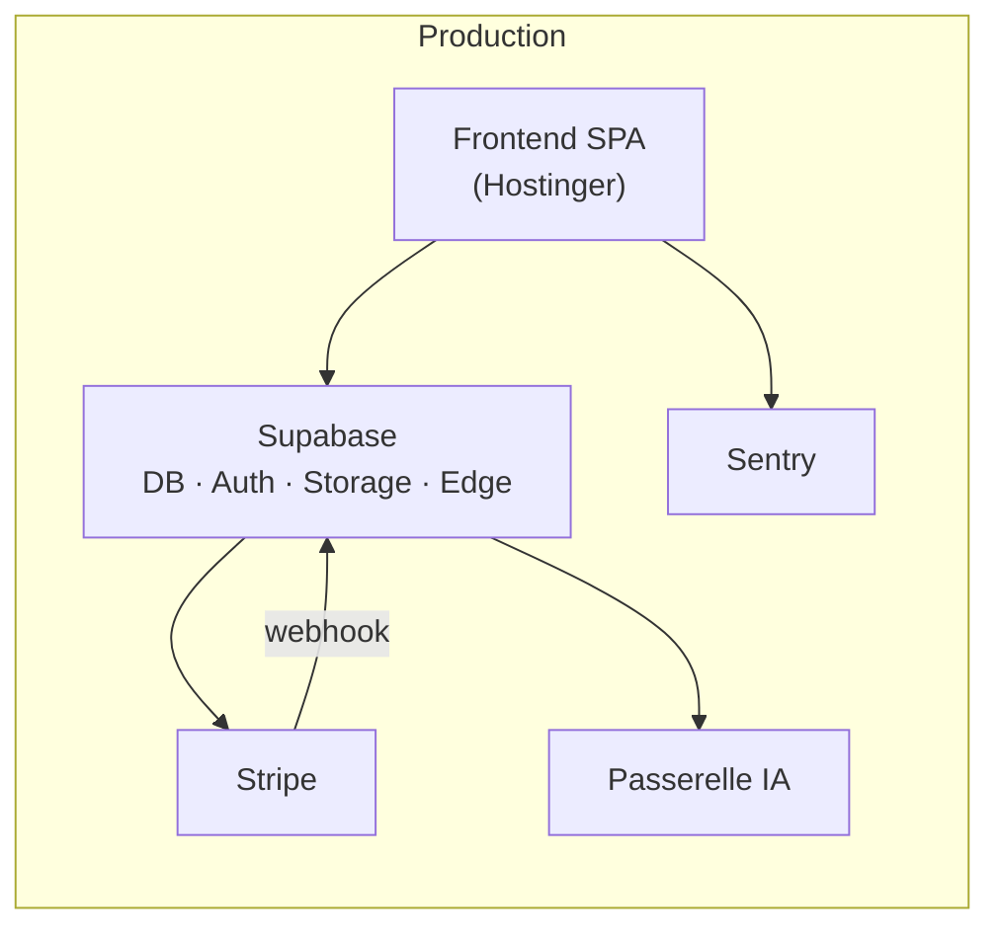

# Guide de déploiement — KOREV Performance Center

**Version :** 1.0  
**Checklist complémentaire :** [`docs/audit/LAUNCH_READINESS.md`](../audit/LAUNCH_READINESS.md)

---

## 1. Vue d'ensemble

Le déploiement couvre quatre composants :

| Composant | Plateforme | Statut dans le dépôt |
|---|---|---|
| Base de données + Auth + Storage | Supabase | Migrations versionnées |
| Edge Functions (10) | Supabase | Code versionné |
| Frontend SPA | Hostinger (Apache/LiteSpeed) | Build Vite → `dist/` |
| Paiements | Stripe | Webhook + Checkout |


```mermaid
flowchart LR
    subgraph Prod["Production"]
        FE["Frontend SPA\n(Hostinger)"]
        SB["Supabase\nDB · Auth · Storage · Edge"]
        ST["Stripe"]
        SN["Sentry"]
        AI["Passerelle IA"]
    end

    FE --> SB
    FE --> SN
    SB --> ST
    SB --> AI
    ST -->|webhook| SB
```

---

## 2. Prérequis

- Compte **Supabase** (projet production)
- Compte **Stripe** (mode live activé pour production)
- Compte **Sentry** (optionnel, recommandé)
- Accès **passerelle IA** (URL + clé API)
- Hébergement **Hostinger** pour le frontend

---

## 3. Supabase — base de données

### 3.1 Appliquer les migrations

**Avant tout `db push` : sauvegarde.** Les migrations sont forward-only et `20260926010000` réécrit `training_videos.video_url`. Activer le PITR (plan payant) ou faire un dump :

```bash
supabase db dump --db-url "<connection-string>" -f backup-$(date +%F).sql
supabase db dump --db-url "<connection-string>" --data-only -f backup-data-$(date +%F).sql
```

```bash
supabase link --project-ref <project-ref>
supabase db push
```

Vérifier l'application des 34 migrations dans l'ordre chronologique (`supabase/migrations/`).

**Ordre de mise en production du durcissement `20260925220000_security_hardening.sql`** : migration → Edge Functions → frontend, dans la même fenêtre. Les nouvelles fonctions appellent `consume_feature_quota` (créée par la migration), et l'ancien frontend incrémente encore `ai_coach` côté client, ce que la migration refuse désormais.

**`20260926010000_private_training_videos_and_feed_privacy.sql`** rend le bucket `training-videos` privé et convertit `training_videos.video_url` (URL publique → chemin d'objet). Le nouveau frontend lit des URLs signées ; l'ancien frontend ne peut plus lire les vidéos uploadées une fois la migration appliquée : déployer le frontend dans la même fenêtre.

**`20260926030000_training_sessions.sql`** ajoute les colonnes de séance (`session_type`, `intensity`, rounds) et `workout_journal.workout_id`. Le frontend 0.10 les lit et les écrit : sans la migration, le carnet, le panneau de séance et les indicateurs ne se chargent plus. Appliquer la migration avant ou avec le frontend ; elle est sans effet sur l'ancien frontend.

**`20260926040000_nutrition_journal_limits.sql`** borne les valeurs du journal alimentaire, des objectifs et du carnet (contraintes `CHECK … NOT VALID` : seules les nouvelles lignes et les modifications sont contrôlées). Pour repérer d'éventuelles lignes anciennes hors bornes avant un `VALIDATE CONSTRAINT` :

```sql
SELECT count(*) FROM nutrition_logs
WHERE calories NOT BETWEEN 0 AND 20000 OR protein_g NOT BETWEEN 0 AND 2000
   OR carbs_g NOT BETWEEN 0 AND 2000 OR fat_g NOT BETWEEN 0 AND 2000
   OR char_length(btrim(food_name)) NOT BETWEEN 1 AND 200;
```

Redéployer la fonction `ai-coach` avec le frontend 0.10.1 (elle lit désormais séances, nutrition, carnet et analyses sparring ; le fichier partagé `_shared/coach-context.ts` est embarqué au déploiement).

**`20260926050000_session_effort.sql`** ajoute `workouts.perceived_effort` (1–10). Le frontend 0.11 le lit pour les indicateurs de performance et l'écrit en fin de séance : sans la migration, le panneau d'entraînement affiche « indicateurs indisponibles » et l'enregistrement d'une séance échoue. Appliquer la migration avant ou avec le frontend, puis redéployer `ai-coach` (effort et charge transmis au coach ; sans la colonne, la fonction se replie sur les autres données).

**`20260926060000_single_active_workout.sql`** garantit une seule séance ouverte par utilisateur (index unique partiel sur `workouts (user_id) WHERE status = 'active'`). Les doublons existants sont d'abord passés en `paused` (la plus récente reste ouverte) : aucune donnée n'est supprimée. Le frontend reprend la séance existante si une création se heurte à l'index. Migration rejouable.

Contrôles après `db push` (SQL editor) :

```sql
-- Doit renvoyer 0 ligne : aucune fonction serveur exécutable par anon/authenticated
SELECT p.oid::regprocedure FROM pg_proc p JOIN pg_namespace n ON n.oid = p.pronamespace
WHERE n.nspname = 'public'
  AND p.proname IN ('sync_stripe_subscription','mark_webhook_processed','is_webhook_processed',
                    'get_user_id_by_stripe_customer','check_subscription_access','create_notification',
                    'consume_feature_quota','refund_feature_quota')
  AND (has_function_privilege('anon', p.oid, 'EXECUTE') OR has_function_privilege('authenticated', p.oid, 'EXECUTE'));

-- Doit renvoyer deux lignes à false
SELECT id, public FROM storage.buckets WHERE id IN ('sparring-videos', 'training-videos');

-- Doit renvoyer 0 : plus aucune URL publique ni email dans le fil communautaire
SELECT count(*) FROM public.training_videos WHERE video_type = 'upload' AND video_url LIKE 'http%';
SELECT count(*) FROM public.community_activities WHERE description ~ '^\S+@\S+ a terminé: ';

-- Politiques UPDATE sans WITH CHECK restantes (à examiner)
SELECT tablename, policyname FROM pg_policies
WHERE schemaname = 'public' AND cmd = 'UPDATE' AND with_check IS NULL;
```

Les `WARNING` émis pendant la migration signalent une politique attendue mais absente : la corriger à la main.

### 3.2 Post-déploiement

1. **Régénérer les types** si le schéma distant diffère :

   ```bash
   supabase gen types typescript --project-id <ref> > src/integrations/supabase/types.ts
   ```

2. **Traiter le drift résiduel** documenté dans [`SCHEMA_DRIFT.md`](../audit/SCHEMA_DRIFT.md) (tables `documents`, `organizations*` — DROP manuel si confirmé).
3. **Provisionner un administrateur** :
   - Créer le compte admin via l'UI ;
   - Exécuter `supabase/seed/seed-admin.example.sql` avec l'UUID effectif.

### 3.3 Auth

- Site URL = domaine frontend production ;
- Redirect URLs : ajouter `https://<domaine-app>/` **et** `https://<domaine-app>/reset-password` (sinon le lien « Mot de passe oublié » est refusé) ;
- Configurer les templates email (confirmation, reset password) ;
- Activer **Secure password change** (Auth → Providers → Email) : un changement de mot de passe hors lien de récupération exige une session récente ;
- Politique mot de passe : **minimum 8 caractères** (Auth → Providers → Email), aligné sur `src/lib/passwordPolicy.ts`. Les comptes existants avec un mot de passe plus court peuvent toujours se connecter ;
- Activer « Confirm email ».

### 3.4 Storage

Buckets requis :

| Bucket | Type | Politique |
|---|---|---|
| `sparring-videos` | Privé | RLS par dossier `auth.uid()` |
| `training-videos` | Privé | Lecture si la ligne `training_videos` est visible (même règles que la table) ; écriture admin/coach dans son dossier |

Les policies sont définies dans les migrations ; vérifier leur présence post-`db push`.

---

## 4. Supabase — Edge Functions

### 4.1 Déploiement

```bash
supabase functions deploy
```

Ou fonction par fonction :

```bash
supabase functions deploy ai-coach
supabase functions deploy ai-stats-analysis
supabase functions deploy analyze-sparring
supabase functions deploy create-checkout
supabase functions deploy check-subscription
supabase functions deploy customer-portal
supabase functions deploy stripe-webhook
supabase functions deploy fetch-mma-results
supabase functions deploy delete-account
supabase functions deploy admin-users
```

`analyze-sparring` borne son exécution à 140 s (limite murale Supabase : 150 s sur le plan gratuit). Au-delà, la fonction est tuée sans rembourser le quota : ne pas augmenter ce budget sans passer sur un plan payant (400 s).

`delete-account` (droit à l'effacement) résilie d'abord les abonnements Stripe, puis efface fichiers et compte. Il requiert `STRIPE_SECRET_KEY`.

`admin-users` sert le back-office (liste, statistiques, édition du profil, plan, suspension) et vérifie le rôle `admin` côté serveur ; les coachs n'ont accès qu'à l'écran Vidéos. La suspension est un bannissement Supabase Auth : connexion et rafraîchissement du jeton sont refusés, et toutes les fonctions rejettent un jeton encore valide (403 `ACCOUNT_SUSPENDED`). Un plan payé via Stripe ne se modifie pas depuis l'admin (409) : passer par le dashboard Stripe.

La configuration JWT est dans `supabase/config.toml` :

- `stripe-webhook` et `fetch-mma-results` : `verify_jwt = false`

### 4.2 Secrets (Dashboard ou CLI)

```bash
supabase secrets set STRIPE_SECRET_KEY=sk_live_...
supabase secrets set STRIPE_WEBHOOK_SECRET=whsec_...
supabase secrets set AI_GATEWAY_API_KEY=<key>
supabase secrets set AI_GATEWAY_URL=<url chat/completions>
supabase secrets set SITE_URL=https://<domaine-app>
supabase secrets set ALLOWED_ORIGINS=https://<domaine-app>
```

| Secret | Obligatoire | Fonctions |
|---|---|---|
| `SUPABASE_URL`, `SUPABASE_SERVICE_ROLE_KEY` | Injectés automatiquement par Supabase (préfixe réservé, ne pas les définir) | Toutes sauf fetch-mma-results |
| `STRIPE_SECRET_KEY` | Oui | Stripe (4 fonctions) + delete-account |
| `STRIPE_WEBHOOK_SECRET` | Oui | stripe-webhook |
| `AI_GATEWAY_API_KEY` | Oui | 3 fonctions IA |
| `AI_GATEWAY_URL` | **Oui** | URL de la passerelle IA. Sans valeur, les 3 fonctions IA échouent (aucune URL par défaut). Vérifier la valeur actuellement utilisée en production avant de redéployer. |
| `LEGACY_AI_GATEWAY_KEY` | Non | Ancien nom de la clé, lu si `AI_GATEWAY_API_KEY` est absent |
| `SITE_URL` | Oui en production | URLs de retour Stripe (checkout, portail) |
| `ALLOWED_ORIGINS` | Oui en production | Origines CORS autorisées (liste séparée par des virgules). Sans valeur, toutes les origines sont acceptées (développement). |

### 4.3 Vérification post-déploiement

```bash
# Test webhook (signature requise — utiliser Stripe CLI)
stripe listen --forward-to https://<ref>.supabase.co/functions/v1/stripe-webhook

# Logs
supabase functions logs stripe-webhook
```

Harness Deno local : `deno test --allow-env --allow-net=none tests/edge`

---

## 5. Stripe

### 5.1 Produits et prix

Quatre plans applicatifs mappés à des produits Stripe :

| Plan | Prix mensuel (UI) | Price ID (code) |
|---|---|---|
| Pro | 14,90 € | `price_1SQSL1DLrTr0qdOpfIx50iSu` |
| Elite | 29,90 € | `price_1SQSLMDLrTr0qdOpffTBpoJL` |
| Senseï | 69 € | `price_1SQSM0DLrTr0qdOpYtZFR50d` |

> Les price IDs sont codés en dur dans `src/pages/Pricing.tsx` **et** dans la liste blanche `CHECKOUT_PRICE_TO_PLAN` de `supabase/functions/_shared/stripe.ts` : `create-checkout` refuse tout autre prix. Les deux doivent être mis à jour avec les IDs live.
>
> Aucun prix annuel n'existe : le choix Mensuel/Annuel est masqué (`YEARLY_BILLING_ENABLED` dans `Pricing.tsx`).

### 5.2 Webhook

1. Dashboard Stripe → Developers → Webhooks ;
2. Endpoint : `https://<project-ref>.supabase.co/functions/v1/stripe-webhook` ;
3. Événements :
   - `checkout.session.completed`
   - `customer.subscription.created`
   - `customer.subscription.updated`
   - `customer.subscription.deleted`
4. Copier le **signing secret** (`whsec_…`) → secret Supabase `STRIPE_WEBHOOK_SECRET`.

### 5.3 Customer Portal

Activer le portail client Stripe (Dashboard → Settings → Billing → Customer portal) pour permettre la gestion d'abonnement via `customer-portal`.

### 5.4 Mapping product → plan

Le mapping `product_id → plan` est centralisé dans `PRODUCT_TO_PLAN` (`supabase/functions/_shared/stripe.ts`), utilisé par `check-subscription` et `stripe-webhook`. Le mettre à jour avec les product IDs live.

---

## 6. Frontend

### 6.1 Build

```bash
npm ci
npm run test:run
npm run build
```

Artefact : dossier `dist/` (assets statiques).

### 6.2 Variables de build

Injecter au moment du build (CI/CD ou plateforme hébergement) :

| Variable | Production |
|---|---|
| `VITE_SUPABASE_URL` | URL projet Supabase production |
| `VITE_SUPABASE_PUBLISHABLE_KEY` | Clé anon production |
| `VITE_SUPABASE_PROJECT_ID` | Référence projet |
| `VITE_SENTRY_DSN` | DSN Sentry production |

### 6.3 Hébergement

`public/.htaccess` (copié dans `dist/`) configure Apache/LiteSpeed (Hostinger) : redirection HTTPS, catch-all SPA vers `index.html`, en-têtes de sécurité (HSTS, `X-Frame-Options`, `nosniff`, `Referrer-Policy`, `Permissions-Policy`) et cache long des assets hashés. Pour un autre hébergeur, reproduire ces règles.

L'application refuse de démarrer si `VITE_SUPABASE_URL` ou `VITE_SUPABASE_PUBLISHABLE_KEY` manque (plus de valeur de secours codée en dur).

**Recommandations minimales :**

- Hébergement statique (SPA) ;
- Redirection catch-all vers `index.html` (React Router) ;
- HTTPS obligatoire ;
- Headers de sécurité (CSP recommandée, à définir selon hébergeur) ;
- Domaine custom configuré dans Supabase Auth (redirect URLs).

**Exemple générique (nginx) :**

```nginx
location / {
    try_files $uri $uri/ /index.html;
}
```

---

## 7. Sentry

Configuration frontend : `src/lib/sentry.ts`

| Paramètre | Production |
|---|---|
| `VITE_SENTRY_DSN` | DSN projet Sentry |
| `tracesSampleRate` | 10 % |
| `replaysOnErrorSampleRate` | 100 % |
| Masquage | `maskAllText: true`, `blockAllMedia: true` |

Initialisation dans `src/main.tsx`. Si `VITE_SENTRY_DSN` est vide, Sentry est désactivé.

Pas d'intégration Sentry Edge Functions dans le périmètre actuel.

---

## 8. Passerelle IA

Prérequis pour les fonctionnalités Coach IA, analyse statistique et sparring :

1. Endpoint compatible OpenAI chat/completions (streaming + vision multi-image) ;
2. Modèles accessibles : `google/gemini-2.5-flash`, `google/gemini-2.5-pro` ;
3. Configurer `AI_GATEWAY_URL` et `AI_GATEWAY_API_KEY` dans les secrets Supabase.

**Points opérationnels non documentés dans le code :**

- Quotas et coûts de la passerelle ;
- Stratégie de rate limiting / file d'attente pour pics d'analyse vidéo ;
- Plan de continuité en cas d'indisponibilité.

---

## 9. CI/CD

Pipeline actuel (`.github/workflows/ci.yml`) :

- Lint (non bloquant) + tests + build sur push/PR `main` ;
- **Pas de déploiement automatique** versionné ;
- Playwright et harness Deno non intégrés.

**Étapes recommandées pour industrialiser :**

1. Job de déploiement frontend (post-build → hébergeur) ;
2. `supabase db push` + `supabase functions deploy` en pipeline séparé (avec secrets CI) ;
3. Job e2e Playwright dédié ;
4. Job Deno `tests/edge/` ;
5. Rendre le lint bloquant (phase 1 roadmap TS).

---

## 10. Checklist de mise en production

| # | Élément | Vérifié |
|---|---|---|
| 0 | Sauvegarde de la base (PITR ou dump) avant `db push` | ☐ |
| 1 | Migrations Supabase appliquées (31 fichiers) | ☐ |
| 2 | Edge Functions déployées (9) | ☐ |
| 3 | Secrets Supabase configurés | ☐ |
| 4 | Stripe produits/prix live créés et IDs alignés | ☐ |
| 5 | Webhook Stripe configuré + secret injecté | ☐ |
| 6 | Customer Portal Stripe activé | ☐ |
| 7 | Admin provisionné (seed) | ☐ |
| 8 | Variables VITE_* injectées au build frontend | ☐ |
| 9 | Frontend déployé + HTTPS + SPA routing | ☐ |
| 10 | Redirect URLs Supabase Auth = domaine prod + `/reset-password`, mot de passe min. 8 | ☐ |
| 11 | Sentry DSN production configuré | ☐ |
| 12 | Passerelle IA opérationnelle | ☐ |
| 13 | Mentions légales finalisées (SIRET, politique confidentialité validée par un juriste) | ☐ |
| 14 | Test parcours : inscription → onboarding → checkout → webhook | ☐ |
| 15 | Test RGPD : export des données puis suppression d'un compte abonné (abonnement annulé dans Stripe) | ☐ |
| 16 | Test mot de passe oublié de bout en bout | ☐ |

Checklist détaillée : [`LAUNCH_READINESS.md`](../audit/LAUNCH_READINESS.md).

---

## 11. Environnements

| Environnement | Recommandation |
|---|---|
| **Development** | `.env` local, Supabase projet dev ou local stack |
| **Staging** | Projet Supabase séparé, Stripe test mode, price IDs dédiés |
| **Production** | Projet Supabase prod, Stripe live, Sentry prod DSN |

Le mapping Stripe `product_id → plan` est couplé aux IDs d'un environnement — prévoir des valeurs distinctes par environnement.

---

## 12. Rollback

| Composant | Stratégie |
|---|---|
| Frontend | Redéployer l'artefact `dist/` précédent puis purger le cache Hostinger/LiteSpeed. **Après `20260926010000`, un frontend antérieur ne lit plus les vidéos d'entraînement** (URL publiques supprimées) |
| Edge Functions | `git checkout <tag>` puis `supabase functions deploy <name>` |
| Migrations DB | **Pas de rollback automatique** — migrations idempotentes ; corrections via nouvelle migration forward-only |
| Stripe | Désactiver webhook temporairement si incident |
| Données | Restauration PITR ou du dump pris avant `db push` |

---

## 13. Monitoring post-lancement

| Signal | Source |
|---|---|
| Erreurs frontend | Sentry |
| Logs Edge Functions | Supabase Dashboard |
| Événements paiement | Stripe Dashboard + table `stripe_webhook_events` |
| Quotas IA | Logs Edge + table `feature_usage` |
| CI | GitHub Actions |

Pas de table `audit_logs` ni observabilité structurée Edge dans le périmètre actuel.

---

© KOREV AI — Guide de déploiement v1.0
