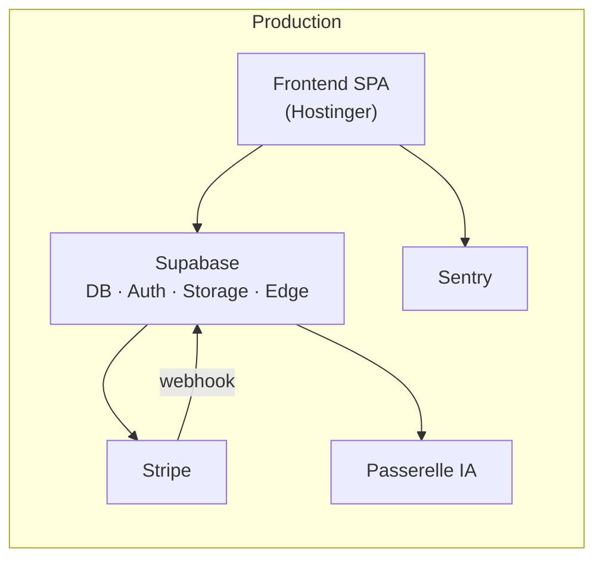

# Guide de déploiement — KOREV Performance Center

**Version :** 1.0  
**Checklist complémentaire :** [`docs/audit/LAUNCH_READINESS.md`](../audit/LAUNCH_READINESS.md)

---

## 1. Vue d'ensemble

Le déploiement couvre quatre composants :

| Composant | Plateforme | Statut dans le dépôt |
|---|---|---|
| Base de données + Auth + Storage | Supabase | Migrations versionnées |
| Edge Functions (10) | Supabase | Code versionné |
| Frontend SPA | Hostinger (Apache/LiteSpeed) | Build Vite → `dist/` |
| Paiements | Stripe | Webhook + Checkout |


```mermaid
flowchart LR
    subgraph Prod["Production"]
        FE["Frontend SPA\n(Hostinger)"]
        SB["Supabase\nDB · Auth · Storage · Edge"]
        ST["Stripe"]
        SN["Sentry"]
        AI["Passerelle IA"]
    end

    FE --> SB
    FE --> SN
    SB --> ST
    SB --> AI
    ST -->|webhook| SB
```

---

## 2. Prérequis

- Compte **Supabase** (projet production)
- Compte **Stripe** (mode live activé pour production)
- Compte **Sentry** (optionnel, recommandé)
- Accès **passerelle IA** (URL + clé API)
- Hébergement **Hostinger** pour le frontend

---

## 3. Supabase — base de données

### 3.1 Appliquer les migrations

**Ordre de mise en production (même fenêtre, dans cet ordre) :**

1. sauvegarde (ci-dessous) et archive du frontend actuel (§12) ;
2. **pré-vol** : exécuter la partie A de [`supabase/preflight/20260927_preflight.sql`](../../supabase/preflight/20260927_preflight.sql) dans le SQL editor (lecture seule). Toutes les lignes `BLOCKER` doivent valoir 0 ; examiner les `HIGH`. Exporter les requêtes « SAVE » de la partie B : c'est le matériel de retour arrière ;
3. `supabase db push` ;
4. contrôles SQL ci-dessous ;
5. secrets (§4.2) puis `supabase functions deploy` (toutes) ;
6. build et envoi du frontend (§6).

`supabase db push` n'enveloppe pas les fichiers dans un `BEGIN` explicite : les instructions qui l'exigent (`LOCK TABLE`) sont placées dans un bloc `DO`. La CI applique les migrations avec la CLI Supabase pour reproduire ce comportement.

Chaque migration en attente commence par `SET lock_timeout = '5s'` : si une table est verrouillée (transaction longue), elle échoue vite au lieu de bloquer le trafic. La relancer quelques minutes plus tard ; les migrations sont rejouables.

La CI rejoue toutes les migrations sur un Postgres vierge, deux fois, puis vérifie les règles d'accès (`supabase/tests/run.sh`, lançable en local avec les variables `PG*`).

**Avant tout `db push` : sauvegarde.** Les migrations sont forward-only et `20260926010000` réécrit `training_videos.video_url`. Activer le PITR (plan payant) ou faire un dump :

```bash
supabase db dump --db-url "<connection-string>" -f backup-$(date +%F).sql
supabase db dump --db-url "<connection-string>" --data-only -f backup-data-$(date +%F).sql
```

```bash
supabase link --project-ref <project-ref>
supabase db push
```

Vérifier l'application des 37 migrations dans l'ordre chronologique (`supabase/migrations/`). La production est à `20260526133146` : 9 migrations sont en attente (`20260925220000` à `20260926080000`).

**Ordre de mise en production du durcissement `20260925220000_security_hardening.sql`** : migration → Edge Functions → frontend, dans la même fenêtre. Les nouvelles fonctions appellent `consume_feature_quota` (créée par la migration), et l'ancien frontend incrémente encore `ai_coach` côté client, ce que la migration refuse désormais.

**`20260926010000_private_training_videos_and_feed_privacy.sql`** rend le bucket `training-videos` privé et convertit `training_videos.video_url` (URL publique → chemin d'objet). Le nouveau frontend lit des URLs signées ; l'ancien frontend ne peut plus lire les vidéos uploadées une fois la migration appliquée : déployer le frontend dans la même fenêtre.

**`20260926030000_training_sessions.sql`** ajoute les colonnes de séance (`session_type`, `intensity`, rounds) et `workout_journal.workout_id`. Le frontend 0.10 les lit et les écrit : sans la migration, le carnet, le panneau de séance et les indicateurs ne se chargent plus. Appliquer la migration avant ou avec le frontend ; elle est sans effet sur l'ancien frontend.

**`20260926040000_nutrition_journal_limits.sql`** borne les valeurs du journal alimentaire, des objectifs et du carnet. Elle corrige d'abord les lignes existantes hors bornes (humeur inconnue → `neutral`, titre vide → « Sans titre », notes tronquées à 5 000 caractères, poids aberrant → vide, valeurs nutritionnelles ramenées dans les bornes, objectifs aberrants → 2000/150/250/70), puis ajoute des contraintes validées. Les lignes concernées sont listées par le pré-vol (H03 à H05).

Redéployer la fonction `ai-coach` avec le frontend 0.10.1 (elle lit désormais séances, nutrition, carnet et analyses sparring ; le fichier partagé `_shared/coach-context.ts` est embarqué au déploiement).

**`20260926050000_session_effort.sql`** ajoute `workouts.perceived_effort` (1–10). Le frontend 0.11 le lit pour les indicateurs de performance et l'écrit en fin de séance : sans la migration, le panneau d'entraînement affiche « indicateurs indisponibles » et l'enregistrement d'une séance échoue. Appliquer la migration avant ou avec le frontend, puis redéployer `ai-coach` (effort et charge transmis au coach ; sans la colonne, la fonction se replie sur les autres données).

**`20260926060000_single_active_workout.sql`** garantit une seule séance ouverte par utilisateur (index unique partiel sur `workouts (user_id) WHERE status = 'active'`). Les doublons existants sont d'abord passés en `paused` (la plus récente reste ouverte) : aucune donnée n'est supprimée. Le frontend reprend la séance existante si une création se heurte à l'index. Migration rejouable.

**`20260926070000_session_details_and_feed.sql`** ajoute `workouts.planned_minutes` (1–240, lu par le frontend : à appliquer avant lui), passe `workout_exercises.exercise_id` en `ON DELETE RESTRICT` (un exercice utilisé ne peut plus être supprimé du catalogue), ajoute une policy restrictive sur `meute_activities.workout_id`, et remplace le déclencheur du fil communautaire pour publier le type de séance au lieu du nom saisi. Migration rejouable.

**`20260926080000_access_guards_fair_use_and_team.sql`** :

- `has_role`, `has_feature_access`, `is_meute_member`, `is_meute_owner` et `get_meute_member_role` ne répondent plus que pour l'appelant lui-même (ou le serveur) : on ne peut plus sonder le rôle ou le plan d'un autre compte. Les versions brutes passent dans le schéma `korev_private` (non exposé par l'API) ; les politiques RLS existantes continuent de fonctionner ;
- plafond quotidien d'usage raisonnable, y compris pour les plans illimités et les coachs : 200 messages Coach IA et 20 analyses PRISM par jour (`get_daily_feature_cap`). Au-delà : 429 `DAILY_LIMIT_REACHED`. Les administrateurs ne sont pas plafonnés ;
- Team :
  - invitation par e-mail uniquement via `invite_team_member`. La réponse est la même que l'adresse ait un compte ou non, ou soit déjà invitée. Les invitations en attente ne sont visibles que de l'invité. Chacun envoie au plus 20 invitations par jour, et la notification ne reprend pas le nom de la team ;
  - un membre peut quitter une team, et une invitation déclinée ne peut plus être acceptée ;
  - membres et activités affichés avec un nom sans e-mail ; activités écrites uniquement par le serveur ;
- longueurs maximales des textes libres (profil, séances, teams, notifications), après troncature des valeurs existantes. À l'inscription, un nom trop long est tronqué au lieu de faire échouer la création du compte ;
- `stripe_webhook_events.payload` ne garde que l'identifiant de l'objet ; les tables héritées hors migrations (`documents`, `organizations*`, `render_usage`) sont fermées au client ;
- le fil communautaire n'est plus lisible que par son auteur (aucun écran ne l'affiche) ;
- les notifications passent en temps réel (publication `supabase_realtime`).

Le quota de scans de code-barres (plan gratuit) reste une limite **côté client** : il ne protège rien de payant. La recherche d'aliments interroge Open Food Facts directement depuis le navigateur. Leur limite est de 10 recherches par minute et par adresse IP, et la recherche au fil de la frappe est interdite. L'app ne cherche donc que sur Entrée ou sur le bouton « Chercher », met les résultats en cache et limite chaque onglet à 8 recherches par minute. Un 429 affiche un message clair. Les quotas qui ont un coût (Coach IA, analyse PRISM) sont décomptés côté serveur.

Contrôles après `db push` (SQL editor) :

```sql
-- Doit renvoyer 0 ligne : aucune fonction serveur exécutable par anon/authenticated
SELECT p.oid::regprocedure FROM pg_proc p JOIN pg_namespace n ON n.oid = p.pronamespace
WHERE n.nspname = 'public'
  AND p.proname IN ('sync_stripe_subscription','mark_webhook_processed','is_webhook_processed',
                    'get_user_id_by_stripe_customer','check_subscription_access','create_notification',
                    'consume_feature_quota','refund_feature_quota')
  AND (has_function_privilege('anon', p.oid, 'EXECUTE') OR has_function_privilege('authenticated', p.oid, 'EXECUTE'));

-- Doit renvoyer deux lignes à false
SELECT id, public FROM storage.buckets WHERE id IN ('sparring-videos', 'training-videos');

-- Doit renvoyer 0 : plus aucune URL publique ni email dans le fil communautaire
SELECT count(*) FROM public.training_videos WHERE video_type = 'upload' AND video_url LIKE 'http%';
SELECT count(*) FROM public.community_activities WHERE description ~ '[^[:space:]]+@[^[:space:]]+';

-- Doit renvoyer 5 lignes : les fonctions d'autorisation brutes sont hors de l'API
SELECT p.oid::regprocedure FROM pg_proc p JOIN pg_namespace n ON n.oid = p.pronamespace
WHERE n.nspname = 'korev_private';

-- Doit renvoyer 0 : aucune séance ouverte en double, aucune contrainte non validée
SELECT count(*) FROM (SELECT user_id FROM public.workouts WHERE status = 'active' GROUP BY 1 HAVING count(*) > 1) d;
SELECT count(*) FROM pg_constraint WHERE connamespace = 'public'::regnamespace AND NOT convalidated;

-- Politiques UPDATE sans WITH CHECK restantes (à examiner)
SELECT tablename, policyname FROM pg_policies
WHERE schemaname = 'public' AND cmd = 'UPDATE' AND with_check IS NULL;
```

Les `WARNING` émis pendant la migration signalent une politique attendue mais absente : la corriger à la main.

Dashboard → Settings → API → **Exposed schemas** : garder `public` et `graphql_public` uniquement. Ne jamais y ajouter `korev_private` : ses fonctions répondent pour n'importe quel compte (elles servent aux politiques RLS).

### 3.2 Post-déploiement

1. **Régénérer les types** si le schéma distant diffère :

   ```bash
   supabase gen types typescript --project-id <ref> > src/integrations/supabase/types.ts
   ```

2. **Traiter le drift résiduel** documenté dans [`SCHEMA_DRIFT.md`](../audit/SCHEMA_DRIFT.md) (tables `documents`, `organizations*` — DROP manuel si confirmé).
3. **Provisionner un administrateur** :
   - Créer le compte admin via l'UI ;
   - Exécuter `supabase/seed/seed-admin.example.sql` avec l'UUID effectif.

### 3.3 Auth

- Site URL = domaine frontend production ;
- Redirect URLs : ajouter `https://<domaine-app>/` **et** `https://<domaine-app>/reset-password` (sinon le lien « Mot de passe oublié » est refusé) ;
- Configurer les templates email (confirmation, reset password) ;
- Activer **Secure password change** (Auth → Providers → Email) : un changement de mot de passe hors lien de récupération exige une session récente ;
- Politique mot de passe : **minimum 8 caractères** (Auth → Providers → Email), aligné sur `src/lib/passwordPolicy.ts`. Les comptes existants avec un mot de passe plus court peuvent toujours se connecter ;
- Activer « Confirm email ».

**SMTP obligatoire avant l'ouverture.** Le service d'e-mail intégré de Supabase n'envoie qu'aux membres de l'organisation Supabase, et 2 e-mails par heure au plus. Sans SMTP, les inscrits ne reçoivent ni confirmation ni lien de mot de passe oublié.

1. Créer un compte chez un fournisseur (Resend, Postmark, Brevo…) et vérifier le domaine d'envoi (enregistrements SPF/DKIM chez l'hébergeur DNS).
2. Auth → Emails → SMTP Settings : hôte, port, identifiant, mot de passe du fournisseur ; expéditeur `no-reply@<domaine>`.
3. Auth → Rate Limits : relever la limite d'e-mails par heure (par exemple 100).
4. Tester une inscription et un mot de passe oublié avec une adresse extérieure à l'organisation.

Recommandé : activer la protection CAPTCHA (Auth → Attack Protection) contre les inscriptions automatisées.

### 3.4 Storage

Buckets requis :

| Bucket | Type | Politique |
|---|---|---|
| `sparring-videos` | Privé | RLS par dossier `auth.uid()` |
| `training-videos` | Privé | Lecture si la ligne `training_videos` est visible (même règles que la table) ; écriture admin/coach dans son dossier |

Les policies sont définies dans les migrations ; vérifier leur présence post-`db push`.

---

## 4. Supabase — Edge Functions

### 4.1 Déploiement

```bash
supabase functions deploy
```

Ou fonction par fonction :

```bash
supabase functions deploy ai-coach
supabase functions deploy ai-stats-analysis
supabase functions deploy analyze-sparring
supabase functions deploy create-checkout
supabase functions deploy check-subscription
supabase functions deploy customer-portal
supabase functions deploy stripe-webhook
supabase functions deploy fetch-mma-results
supabase functions deploy delete-account
supabase functions deploy admin-users
```

Toutes les fonctions sont à redéployer avec cette version : `ai-coach`, `ai-stats-analysis`, `analyze-sparring`, `fetch-mma-results`, `stripe-webhook`, `delete-account`, `create-checkout`, `check-subscription` et `customer-portal` ont changé directement ou via `_shared/`.

`delete-account` exige que la session en cours ait été ouverte il y a moins de 15 minutes (champ `amr` du jeton ; 403 `REAUTH_REQUIRED`) : l'app propose alors de se reconnecter. Une connexion sur un autre appareil ne débloque pas une session ancienne.

`fetch-mma-results` garde les actualités 10 minutes en mémoire et ignore les articles sans date valide.

`analyze-sparring` borne son exécution à 140 s (limite murale Supabase : 150 s sur le plan gratuit). Au-delà, la fonction est tuée sans rembourser le quota : ne pas augmenter ce budget sans passer sur un plan payant (400 s).

`delete-account` (droit à l'effacement) résilie d'abord les abonnements Stripe, puis efface fichiers et compte. Il requiert `STRIPE_SECRET_KEY`.

`admin-users` sert le back-office (liste, statistiques, édition du profil, plan, suspension) et vérifie le rôle `admin` côté serveur ; les coachs n'ont accès qu'à l'écran Vidéos. La suspension est un bannissement Supabase Auth : connexion et rafraîchissement du jeton sont refusés, et toutes les fonctions rejettent un jeton encore valide (403 `ACCOUNT_SUSPENDED`). Un plan payé via Stripe ne se modifie pas depuis l'admin (409) : passer par le dashboard Stripe.

La configuration JWT est dans `supabase/config.toml` :

- `stripe-webhook` et `fetch-mma-results` : `verify_jwt = false`

### 4.2 Secrets (Dashboard ou CLI)

```bash
supabase secrets set STRIPE_SECRET_KEY=sk_live_...
supabase secrets set STRIPE_WEBHOOK_SECRET=whsec_...
supabase secrets set AI_GATEWAY_API_KEY=<key>
supabase secrets set AI_GATEWAY_URL=<url chat/completions>
supabase secrets set SITE_URL=https://<domaine-app>
supabase secrets set ALLOWED_ORIGINS=https://<domaine-app>,https://www.<domaine-app>
supabase secrets set STRIPE_PRICE_PRO=price_... STRIPE_PRICE_ELITE=price_... STRIPE_PRICE_SENSEI=price_...
supabase secrets set STRIPE_PRODUCT_PRO=prod_... STRIPE_PRODUCT_ELITE=prod_... STRIPE_PRODUCT_SENSEI=prod_...
```

| Secret | Obligatoire | Fonctions |
|---|---|---|
| `SUPABASE_URL`, `SUPABASE_SERVICE_ROLE_KEY` | Injectés automatiquement par Supabase (préfixe réservé, ne pas les définir) | Toutes sauf fetch-mma-results |
| `STRIPE_SECRET_KEY` | Oui | Stripe (4 fonctions) + delete-account |
| `STRIPE_WEBHOOK_SECRET` | Oui | stripe-webhook |
| `AI_GATEWAY_API_KEY` | Oui | 3 fonctions IA |
| `AI_GATEWAY_URL` | **Oui** | URL de la passerelle IA. Sans valeur, les 3 fonctions IA échouent (aucune URL par défaut). Vérifier la valeur actuellement utilisée en production avant de redéployer. |
| `LEGACY_AI_GATEWAY_KEY` | Non | Ancien nom de la clé, lu si `AI_GATEWAY_API_KEY` est absent |
| `SITE_URL` | Oui en production | URLs de retour Stripe (checkout, portail) |
| `ALLOWED_ORIGINS` | Oui en production | Origines CORS autorisées (liste séparée par des virgules). Sans valeur, toutes les origines sont acceptées (développement). Lister le domaine nu **et** `www` : le `.htaccess` redirige `www` vers le domaine nu, mais une origine absente bloque toutes les fonctions. |
| `STRIPE_PRICE_PRO`, `STRIPE_PRICE_ELITE`, `STRIPE_PRICE_SENSEI` | **Oui avec une clé live** (`sk_live_` ou restreinte `rk_live_`) | Prix mensuels live. Sans eux, le checkout et la synchronisation échouent au lieu d'enregistrer un abonné payant en plan gratuit. En mode test, les IDs de test du code sont utilisés |
| `STRIPE_PRODUCT_PRO`, `STRIPE_PRODUCT_ELITE`, `STRIPE_PRODUCT_SENSEI` | **Oui avec une clé live** | Produits live correspondants (webhook, `check-subscription`) |
| `AI_MODEL_FAST`, `AI_MODEL_PRO` | Non | Modèles de la passerelle. Par défaut `google/gemini-2.5-flash` (coach, analyse de stats, PRISM rapide) et `google/gemini-2.5-pro` (PRISM complet). Permet de changer de modèle sans redéployer le code |

### 4.3 Vérification post-déploiement

```bash
# Test webhook (signature requise — utiliser Stripe CLI)
stripe listen --forward-to https://<ref>.supabase.co/functions/v1/stripe-webhook

# Logs
supabase functions logs stripe-webhook
```

Harness Deno local : `deno test --allow-env --allow-net=none tests/edge`

---

## 5. Stripe

### 5.1 Produits et prix

Quatre plans applicatifs mappés à des produits Stripe :

| Plan | Prix mensuel (UI) | Price ID de test (repli du code) |
|---|---|---|
| Pro | 14,90 € | `price_1SQSL1DLrTr0qdOpfIx50iSu` |
| Elite | 29,90 € | `price_1SQSLMDLrTr0qdOpffTBpoJL` |
| Senseï | 69 € | `price_1SQSM0DLrTr0qdOpYtZFR50d` |

> Le frontend n'envoie plus d'ID de prix, seulement le plan (`pro`, `elite`, `sensei`) : `create-checkout` choisit le prix côté serveur. En live, créer les 3 produits et prix mensuels dans Stripe et renseigner les secrets `STRIPE_PRICE_*` / `STRIPE_PRODUCT_*` (§4.2) : aucun rebuild du frontend n'est nécessaire.
>
> `create-checkout` refuse aussi un paiement si le client Stripe a déjà un abonnement actif, en essai, en retard de paiement (`past_due`) ou impayé : il est renvoyé vers le portail.
>
> Avant le paiement, l'utilisateur coche une case de renonciation au droit de rétractation (exécution immédiate du service, article L221-28 du Code de la consommation). `create-checkout` refuse la session sans elle (400 `WITHDRAWAL_WAIVER_REQUIRED`) et horodate l'accord dans les métadonnées Stripe (`withdrawal_waiver_at`) de la session et de l'abonnement. Faire valider le texte par un juriste.
>
> Aucun prix annuel n'existe : le choix Mensuel/Annuel est masqué (`YEARLY_BILLING_ENABLED` dans `Pricing.tsx`).

### 5.2 Webhook

1. Dashboard Stripe → Developers → Webhooks ;
2. Endpoint : `https://<project-ref>.supabase.co/functions/v1/stripe-webhook` ;
3. Événements :
   - `checkout.session.completed`
   - `customer.subscription.created`
   - `customer.subscription.updated`
   - `customer.subscription.deleted`
4. Copier le **signing secret** (`whsec_…`) → secret Supabase `STRIPE_WEBHOOK_SECRET`.

### 5.3 Customer Portal

Dashboard → Settings → Billing → Customer portal, **en mode live** :

1. activer le portail ;
2. « Subscriptions » → autoriser le changement de plan et y ajouter les 3 produits live avec leur prix mensuel. Un abonné actif qui veut changer d'offre y est renvoyé (`create-checkout` refuse un second abonnement) ; sans cette configuration, personne ne peut monter en gamme ;
3. autoriser l'annulation (fin de période) et la mise à jour du moyen de paiement ;
4. renseigner les liens vers les CGV et la politique de confidentialité (`https://<domaine-app>/legal`).

Un changement d'offre dans le portail ne repasse pas par la case de renonciation : faire valider par le juriste que l'accord donné au premier paiement couvre les changements d'offre, ou ajouter un texte dans le portail.

### 5.4 Mapping product → plan

Le mapping `product_id → plan` est centralisé dans `supabase/functions/_shared/stripe.ts` (`planFromSubscription`), utilisé par `check-subscription` et `stripe-webhook`. Il lit les secrets `STRIPE_PRODUCT_*` et `STRIPE_PRICE_*`. Un produit inconnu fait échouer la synchronisation (Stripe relance le webhook) au lieu de passer l'abonné payant en plan gratuit.

---

## 6. Frontend

### 6.1 Build

```bash
npm ci
npm run test:run
npm run build
```

Artefact : dossier `dist/` (assets statiques).

### 6.2 Variables de build

Injecter au moment du build (CI/CD ou plateforme hébergement) :

| Variable | Production |
|---|---|
| `VITE_SUPABASE_URL` | URL projet Supabase production |
| `VITE_SUPABASE_PUBLISHABLE_KEY` | Clé anon production |
| `VITE_SUPABASE_PROJECT_ID` | Référence projet |
| `VITE_SENTRY_DSN` | DSN Sentry production |
| `VITE_SITE_URL` | `https://<domaine-app>`, sans `/` final (cartes de partage : `og:image`, `og:url`) |

Toujours reconstruire `dist/` juste avant l'envoi (le dossier local peut dater d'une version précédente). `npm run build` échoue si `VITE_SUPABASE_URL` ou `VITE_SUPABASE_PUBLISHABLE_KEY` manque ou contient encore un `<…>` de l'exemple. Sans `VITE_SENTRY_DSN`, aucune erreur de production n'est remontée.

### 6.3 Hébergement

`public/.htaccess` (copié dans `dist/`) configure Apache/LiteSpeed (Hostinger) : redirection HTTPS, catch-all SPA vers `index.html`, en-têtes de sécurité (HSTS, `X-Frame-Options`, `nosniff`, `Referrer-Policy`, `Permissions-Policy`) et cache long des assets hashés. Pour un autre hébergeur, reproduire ces règles.

Le `.htaccess` redirige aussi `www.<domaine>` vers le domaine nu (une seule origine : sessions et CORS cohérents). HSTS est posé sans `includeSubDomains`. La politique de sécurité en mode rapport (`Content-Security-Policy-Report-Only`) contient la référence du projet Supabase `vpvfkazmfvxbpffymodg` : la modifier si le projet change.

**Envoi sur Hostinger (gestionnaire de fichiers ou FTP) :** envoyer le **contenu** de `dist/` dans `public_html/`. Le Finder de macOS masque les fichiers commençant par un point (Cmd+Maj+. pour les afficher) : vérifier que `public_html/.htaccess` **et** `public_html/assets/.htaccess` sont bien présents sur le serveur, sinon le routage SPA, les en-têtes de sécurité et le cache ne fonctionnent pas.

**Contrôles après envoi :**

- `https://<domaine-app>/pricing` rechargé directement s'affiche (routage SPA) ;
- `https://www.<domaine-app>` redirige vers `https://<domaine-app>` ;
- `curl -sI https://<domaine-app>/ | grep -i strict-transport` renvoie l'en-tête HSTS ;
- `https://<domaine-app>/assets/inexistant.js` renvoie 404 (et non `index.html`) ;
- inscription avec une adresse externe : l'e-mail de confirmation arrive.

L'application refuse de démarrer si `VITE_SUPABASE_URL` ou `VITE_SUPABASE_PUBLISHABLE_KEY` manque (plus de valeur de secours codée en dur).

**Recommandations minimales :**

- Hébergement statique (SPA) ;
- Redirection catch-all vers `index.html` (React Router) ;
- HTTPS obligatoire ;
- Headers de sécurité (CSP recommandée, à définir selon hébergeur) ;
- Domaine custom configuré dans Supabase Auth (redirect URLs).

**Exemple générique (nginx) :**

```nginx
location / {
    try_files $uri $uri/ /index.html;
}
```

---

## 7. Sentry

Configuration frontend : `src/lib/sentry.ts`

| Paramètre | Production |
|---|---|
| `VITE_SENTRY_DSN` | DSN projet Sentry |
| `tracesSampleRate` | 10 % |
| `replaysOnErrorSampleRate` | 100 % |
| Masquage | `maskAllText: true`, `blockAllMedia: true` |

Initialisation dans `src/main.tsx`. Si `VITE_SENTRY_DSN` est vide, Sentry est désactivé.

Pas d'intégration Sentry Edge Functions dans le périmètre actuel.

---

## 8. Passerelle IA

Prérequis pour les fonctionnalités Coach IA, analyse statistique et sparring :

1. Endpoint compatible OpenAI chat/completions (streaming + vision multi-image) ;
2. Modèles accessibles : par défaut `google/gemini-2.5-flash` et `google/gemini-2.5-pro`, remplaçables par `AI_MODEL_FAST` / `AI_MODEL_PRO`. Sur Google Cloud (Vertex), ces deux modèles sont retirés le 20 octobre 2026 : demander au fournisseur de la passerelle quel backend il utilise et prévoir le modèle de remplacement ;
3. Configurer `AI_GATEWAY_URL` et `AI_GATEWAY_API_KEY` dans les secrets Supabase ;
4. **Définir un plafond de dépense et une alerte** chez le fournisseur de la passerelle. Le plafond quotidien par compte (200 messages, 20 analyses) borne un abus isolé, pas une montée en charge.

Les appels à la passerelle ont un délai de 30 s avant le premier octet (504 « Le service IA ne répond pas »). Le quota est remboursé si la réponse est vide, si la passerelle renvoie une erreur ou si le flux est coupé avant le premier mot.

**Points opérationnels non documentés dans le code :**

- Quotas et coûts de la passerelle ;
- Stratégie de rate limiting / file d'attente pour pics d'analyse vidéo ;
- Plan de continuité en cas d'indisponibilité.

---

## 9. CI/CD

Pipeline actuel (`.github/workflows/ci.yml`) :

- Frontend : lint (bloquant), vérification des types, Vitest, build ;
- Edge Functions : `deno check` de toutes les fonctions et tests `tests/edge` ;
- Base : rejeu des migrations sur Postgres 15 (deux fois) et tests des règles d'accès (`supabase/tests/`) ;
- **Pas de déploiement automatique**.

**Étapes recommandées pour industrialiser :**

1. Job de déploiement frontend (post-build → hébergeur) ;
2. `supabase db push` + `supabase functions deploy` en pipeline séparé (avec secrets CI) ;
3. Job e2e Playwright dédié.

---

## 10. Checklist de mise en production

| # | Élément | Vérifié |
|---|---|---|
| 0 | Sauvegarde de la base (PITR ou dump) avant `db push`, tag git et archive du `dist/` en ligne | ☐ |
| 0b | Pré-vol `supabase/preflight/20260927_preflight.sql` : BLOCKER = 0, HIGH examinés, SAVE exportés | ☐ |
| 1 | Migrations Supabase appliquées (37 fichiers, dernière `20260926080000`) | ☐ |
| 2 | Edge Functions déployées (10) | ☐ |
| 3 | Secrets Supabase configurés (dont `STRIPE_PRICE_*`, `STRIPE_PRODUCT_*`, `ALLOWED_ORIGINS` avec et sans `www`) | ☐ |
| 4 | Stripe produits/prix live créés | ☐ |
| 5 | Webhook Stripe configuré + secret injecté | ☐ |
| 6 | Customer Portal Stripe : changement de plan avec les 3 produits live, annulation, liens CGV | ☐ |
| 6b | SMTP configuré, limite d'e-mails relevée, inscription testée avec une adresse externe | ☐ |
| 6c | Plafond de dépense et alerte sur la passerelle IA | ☐ |
| 7 | Admin provisionné (seed) | ☐ |
| 8 | Variables VITE_* injectées au build frontend | ☐ |
| 9 | Frontend déployé + HTTPS + SPA routing | ☐ |
| 10 | Redirect URLs Supabase Auth = domaine prod + `/reset-password`, mot de passe min. 8 | ☐ |
| 11 | Sentry DSN production configuré | ☐ |
| 12 | Passerelle IA opérationnelle | ☐ |
| 13 | Mentions légales finalisées (SIRET, politique confidentialité validée par un juriste) | ☐ |
| 14 | Test parcours : inscription → onboarding → checkout → webhook | ☐ |
| 15 | Test RGPD : export des données puis suppression d'un compte abonné (abonnement annulé dans Stripe) | ☐ |
| 16 | Test mot de passe oublié de bout en bout | ☐ |

Checklist détaillée : [`LAUNCH_READINESS.md`](../audit/LAUNCH_READINESS.md).

---

## 11. Environnements

| Environnement | Recommandation |
|---|---|
| **Development** | `.env` local, Supabase projet dev ou local stack |
| **Staging** | Projet Supabase séparé, Stripe test mode, price IDs dédiés |
| **Production** | Projet Supabase prod, Stripe live, Sentry prod DSN |

Aujourd'hui, `.env` pointe sur le projet de production : `npm run dev` lit et écrit les vraies données. Créer un projet de staging avant d'ouvrir l'app, pour tester les migrations et les parcours de paiement.

Le plan Supabase gratuit n'a ni sauvegarde automatique ni PITR, et limite le trafic sortant à 5 Go par mois (les vidéos servies depuis Storage le consomment vite). Le plan Pro est recommandé pour la production.

Le mapping Stripe `product_id → plan` est couplé aux IDs d'un environnement — prévoir des valeurs distinctes par environnement.

---

## 12. Rollback

| Composant | Stratégie |
|---|---|
| Frontend | Avant chaque envoi : `git tag vX.Y.Z` et archive du site en ligne (`public_html` → zip depuis le gestionnaire de fichiers, ou `zip -r dist-vX.Y.Z.zip dist` du build précédent). Retour arrière : renvoyer l'archive puis purger le cache Hostinger/LiteSpeed. **Après `20260926010000`, un frontend antérieur ne lit plus les vidéos d'entraînement** (URL publiques supprimées) |
| Edge Functions | `git checkout <tag>` puis `supabase functions deploy <name>` |
| Migrations DB | **Pas de rollback automatique** — migrations idempotentes ; corrections via nouvelle migration forward-only. Les résultats « SAVE » du pré-vol contiennent les corps de fonctions, politiques et lignes réécrites d'avant la migration |
| Stripe | Désactiver webhook temporairement si incident |
| Données | Restauration PITR ou du dump pris avant `db push` |

---

## 13. Monitoring post-lancement

| Signal | Source |
|---|---|
| Erreurs frontend | Sentry |
| Logs Edge Functions | Supabase Dashboard |
| Événements paiement | Stripe Dashboard + table `stripe_webhook_events` |
| Quotas IA | Logs Edge + tables `feature_usage` (mois) et `feature_daily_usage` (jour, 7 jours conservés) |
| CI | GitHub Actions |

Pas de table `audit_logs` ni observabilité structurée Edge dans le périmètre actuel.

---

© KOREV AI — Guide de déploiement v1.0
